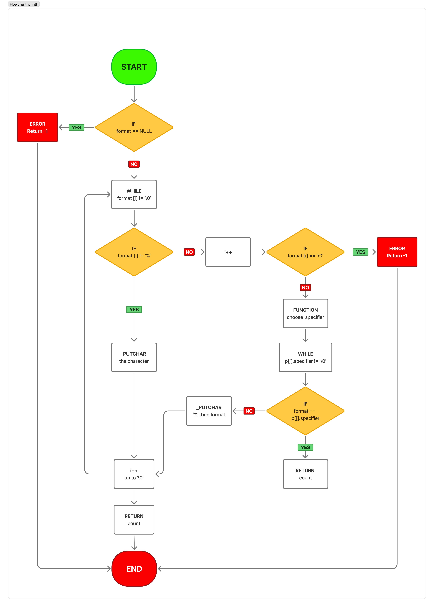

# Printf Project

## Description
This project is a custom implementation of the `printf` function in C. It handles various format specifiers like `%c`, `%s`, `%d`, `%i`, and `%%`. This implementation follows the behavior of the standard library's `printf` function but is built from scratch.

## Requirements

- Ubuntu 20.04 LTS
- GCC compiler (version 9.3.0 or later)
- Git for version control
- Standard C library

## Compilation

To compile the _printf function and its dependencies, use the following command:

```bash
gcc -Wall -Werror -Wextra -pedantic -std=gnu89 *.c -o printf
```

This will create an executable named 'printf' that you can run with various test cases.

## Files and Structure

- **_printf.c**: Contains the main `_printf` function that parses the format string
- **print_all.c**: Contains handler functions for different format specifiers
- **choose_specifier.c**: Contains the logic to select the appropriate handler function
- **main.h**: Header file with function prototypes and structure definitions

## Function Prototypes

```c
int _printf(const char *format, ...);
int print_char(va_list arg);
int print_string(va_list arg);
int print_percent(va_list arg);
int print_integer(va_list arg);
int print_long(va_list arg);
int print_digits(int n);
int choose_specifier(char format, va_list args, struct print_s p[]);
int _putchar(char c);
```

## Supported Format Specifiers

- `%c`: Prints a single character
- `%s`: Prints a string
- `%d`, `%i`: Prints an integer
- `%%`: Prints a percent sign

## Examples

### Basic Usage

```c
#include "main.h"

int main(void)
{
    _printf("Hello, %s!\n", "world");
    // Output: Hello, world!
    
    _printf("The value of pi is approximately %d.%d\n", 3, 14);
    // Output: The value of pi is approximately 3.14
    
    _printf("Character: %c\n", 'A');
    // Output: Character: A
    
    _printf("Percent sign: %%\n");
    // Output: Percent sign: %
    
    return (0);
}
```

### Handling Integers

```c
#include "main.h"
#include <limits.h>

int main(void)
{
    _printf("Positive integer: %d\n", 12345);
    // Output: Positive integer: 12345
    
    _printf("Negative integer: %d\n", -9876);
    // Output: Negative integer: -9876
    
    _printf("Zero: %d\n", 0);
    // Output: Zero: 0
    
    _printf("INT_MIN: %d\n", INT_MIN);
    // Output: INT_MIN: -2147483648
    
    _printf("INT_MAX: %d\n", INT_MAX);
    // Output: INT_MAX: 2147483647
    
    return (0);
}
```

### Handling Strings

```c
#include "main.h"

int main(void)
{
    _printf("Regular string: %s\n", "Hello");
    // Output: Regular string: Hello
    
    _printf("Empty string: %s\n", "");
    // Output: Empty string: 
    
    _printf("NULL string: %s\n", NULL);
    // Output: NULL string: (null)
    
    return (0);
}
```

## Testing

We tested our _printf implementation extensively to ensure it behaves identically to the standard printf function in all supported cases.

### Test Cases

We created a comprehensive test suite in main.c that covers:
- Basic format specifiers
- Edge cases
- Error handling

Example test run:

```bash
$ ./printf_test
Character: A
Character: A
Length _printf: 13, Length printf: 13

String: I'm a string!
String: I'm a string!
Length _printf: 22, Length printf: 22

Percent sign: %
Percent sign: %
Length _printf: 16, Length printf: 16

INT_MIN: -2147483648
INT_MIN: -2147483648
Length _printf: 21, Length printf: 21
```

## Flowchart of _printf



## Implementation Challenges

During the development of this project, several challenges were encountered:

1. **Code Segmentation**: Breaking down the functionality into separate functions to maintain code clarity while respecting the limit of 5 functions per file was challenging. We had to carefully distribute functions across files to maintain logical cohesion.

2. **Edge Cases Handling**: Properly handling edge cases such as:
   - NULL format strings
   - Format specifiers at the end of strings
   - Missing arguments for format specifiers
   - INT_MIN (-2147483648) which requires special treatment due to two's complement representation

3. **Recursion Implementation**: Implementing a recursive solution for printing integers digit by digit required careful consideration to ensure correct printing order and proper handling of negative numbers.

4. **Maintaining Consistency**: Ensuring our implementation behaves consistently with the standard `printf` function across all supported specifiers required extensive testing and debugging.

## Conclusion

This custom implementation of the `printf` function demonstrates the complexity behind this seemingly simple standard library function. The project provides a deep understanding of variable arguments in C, string parsing, and modular programming techniques.

By building this function from scratch, we've gained insights into proper error handling, edge case management, and the importance of recursive thinking in programming.

## Authors
- Lucas and Stéphane
